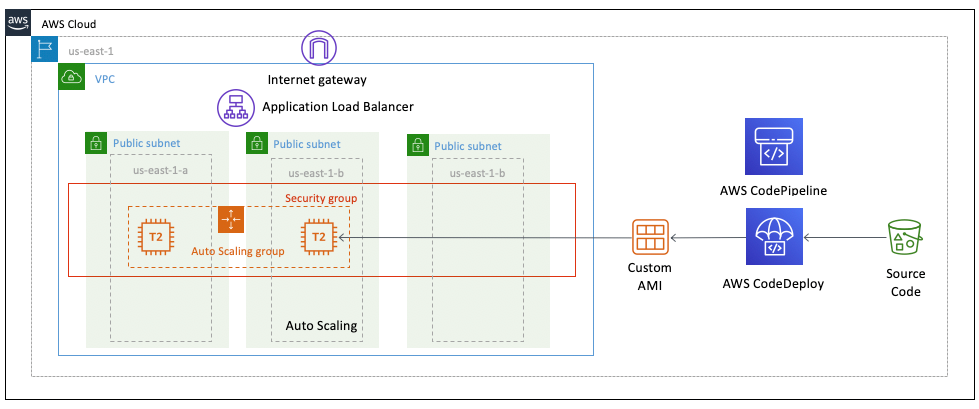

# ec2-windows-codedeploy

Learning how to use CDK to set up an environment to CD legacy .NET apps to Windows EC2 services.

Borrowing heavily from [this AWS tutorial](https://migrate-webapps.workshop.aws/) we will start to automate the process. There will be some manual setup work, we will look to automate more as we go on.

## Pre Work

Of course, you will want to have an AWS account.

### Base AMI
Follow the [Master Image](https://migrate-webapps.workshop.aws/30_automation/10_master_image.html) directions of the workshop to give us the AMI we will use to build out our EC2 fleet.

Contrary to the tutorial, I am allowing RDP to machines to debug as we are still learning :)

## Build out the Infra stack

## Build the Continuous Deployment bit

## Automate the CD thing using S3 as a trigger
